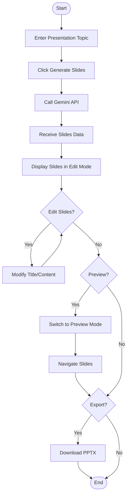
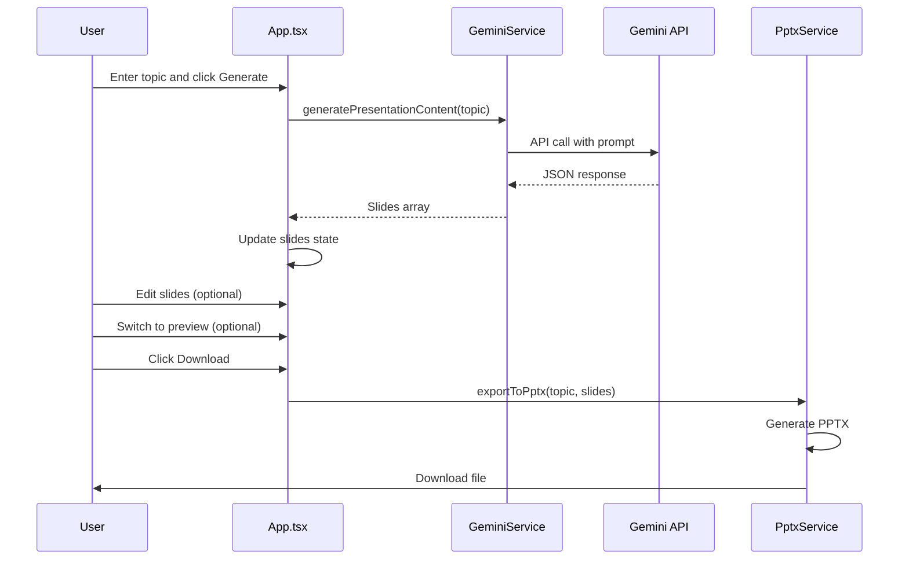
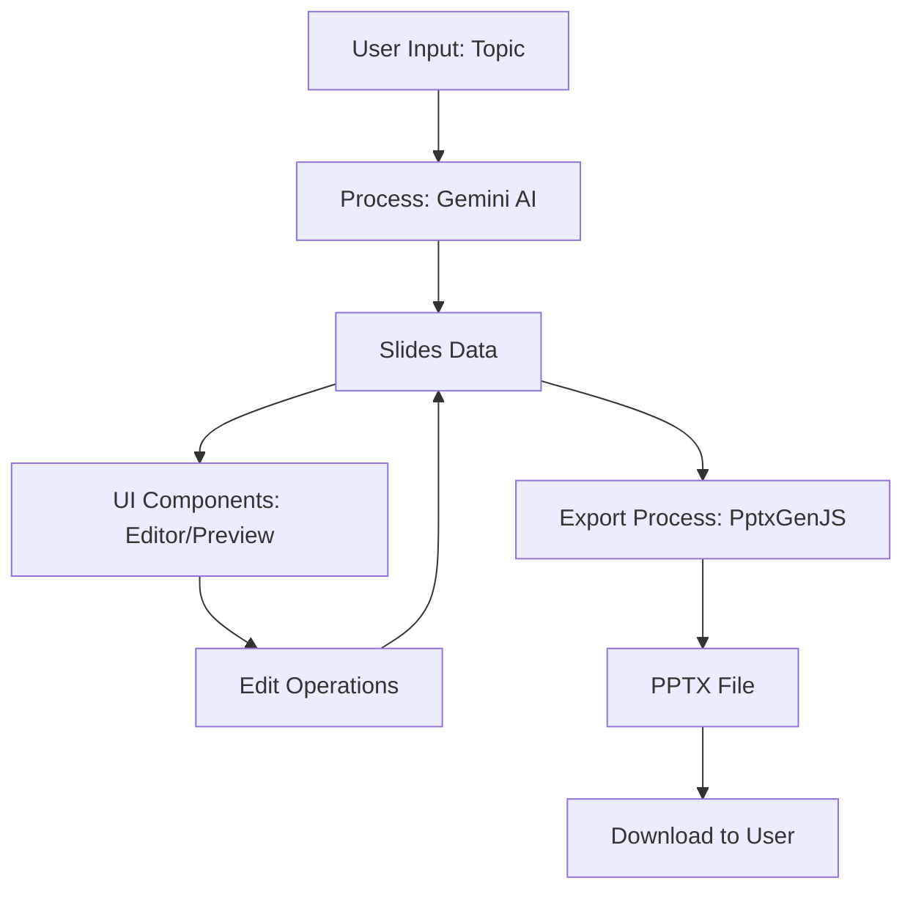
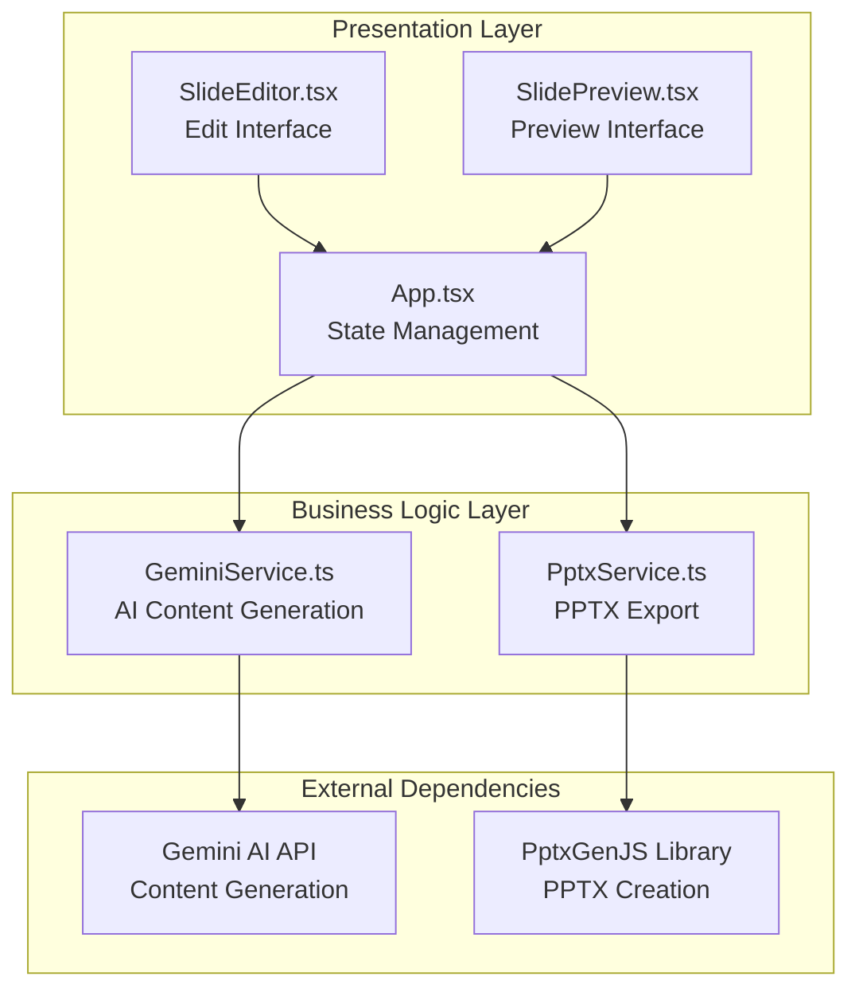
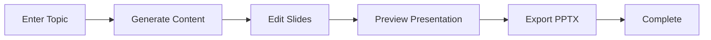
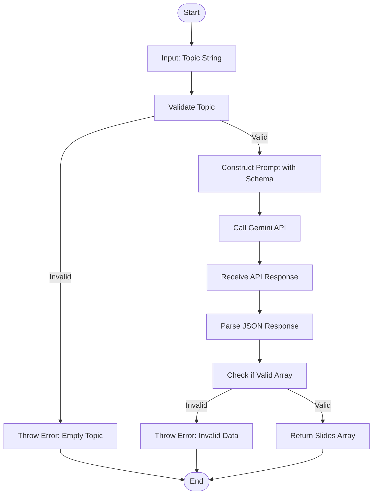
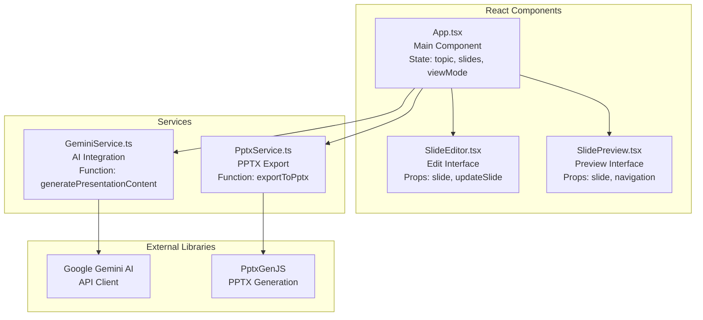

  # AI Presentation Generator - Comprehensive Project Report

## Project Overview

### Introduction
The AI Presentation Generator is a modern web application that leverages artificial intelligence to create professional PowerPoint presentations automatically. Built using React, TypeScript, and Google's Gemini AI, this tool allows users to generate complete presentations by simply providing a topic, with options for editing and customization before export.

### Project Name and Version
- **Project Name**: ai-presentation-generator
- **Version**: 0.0.0
- **Author**: Huzaif Hosmani
- **Technology Stack**: React 19.2.0, TypeScript, Vite, Google Gemini AI, PptxGenJS

### Purpose and Scope
The application serves as a productivity tool for professionals, educators, and content creators who need to generate presentation materials quickly. It combines AI-powered content generation with user-friendly editing capabilities and professional export functionality.

### Key Features
- **AI-Powered Content Generation**: Uses Google's Gemini 2.5-flash model to create structured presentation content
- **Interactive Editing**: Real-time slide editing with title and content modification
- **Dual View Modes**: Edit mode for content creation and preview mode for presentation viewing
- **Professional Export**: Generates PowerPoint (.pptx) files with custom themes and layouts
- **Responsive Design**: Modern UI built with Tailwind CSS for optimal user experience
- **Bullet Point Formatting**: Automatic processing of content into professional bullet points

## Technical Architecture

### System Architecture
The application follows a component-based architecture typical of modern React applications:

```
┌─────────────────┐    ┌─────────────────┐    ┌─────────────────┐
│   User Interface│    │   Business Logic │    │   External APIs │
│                 │    │                 │    │                 │
│ - App.tsx       │◄──►│ - Services      │◄──►│ - Gemini AI     │
│ - Components    │    │   Layer         │    │ - PptxGenJS     │
│ - State Mgmt    │    │                 │    │                 │
└─────────────────┘    └─────────────────┘    └─────────────────┘
```

### Technology Stack Details

#### Frontend Framework
- **React 19.2.0**: Latest version of React with concurrent features and improved performance
- **TypeScript**: Provides type safety and better developer experience
- **Vite**: Fast build tool and development server

#### AI Integration
- **Google Gemini AI**: Advanced language model for content generation
- **@google/genai SDK**: Official SDK for interacting with Gemini API
- **Structured Output**: Uses JSON schema validation for consistent content generation

#### Presentation Generation
- **PptxGenJS**: JavaScript library for creating PowerPoint presentations
- **Custom Themes**: Professional color schemes and layouts
- **Master Slides**: Consistent branding across all slides

#### Styling and UI
- **Tailwind CSS**: Utility-first CSS framework for responsive design
- **Custom Icons**: SVG-based icon components
- **Gradient Backgrounds**: Modern visual design with subtle gradients

### Project Structure
```
freshpptgenerTOR/
├── .env.local              # Environment variables (API key)
├── .gitignore              # Git ignore rules
├── App.tsx                 # Main application component
├── index.html              # HTML entry point
├── index.tsx               # React entry point
├── package.json            # Project dependencies and scripts
├── tsconfig.json           # TypeScript configuration
├── vite.config.ts          # Vite configuration
├── types.ts                # TypeScript type definitions
├── components/             # React components
│   ├── Icons.tsx          # Custom icon components
│   ├── SlideEditor.tsx    # Slide editing interface
│   └── SlidePreview.tsx   # Slide preview component
└── services/               # API and service files
    ├── geminiService.ts   # Gemini AI integration
    └── pptxService.ts     # PowerPoint generation
```

## Code Analysis

### Main Application Component (App.tsx)

The `App.tsx` file serves as the root component and manages the application's global state and user interactions.

#### State Management
```typescript
const [topic, setTopic] = useState<string>('');
const [slides, setSlides] = useState<Slide[]>([...]);
const [isLoading, setIsLoading] = useState<boolean>(false);
const [error, setError] = useState<string | null>(null);
const [viewMode, setViewMode] = useState<'edit' | 'preview'>('edit');
const [currentSlideIndex, setCurrentSlideIndex] = useState<number>(0);
```

#### Key Functions
- `handleGenerateSlides`: Orchestrates AI content generation
- `addSlide`: Adds new slides to the presentation
- `removeSlide`: Removes slides with validation
- `updateSlide`: Updates slide content in real-time
- `handleDownload`: Initiates PowerPoint export

#### UI Structure
The component renders a comprehensive interface with:
- Header with branding and navigation
- Topic input section with generation controls
- View mode toggle (Edit/Preview)
- Dynamic slide rendering based on current mode
- Action buttons for adding slides and downloading

### Component Analysis

#### SlideEditor Component
Located in `components/SlideEditor.tsx`, this component provides the editing interface for individual slides.

**Key Features:**
- Real-time title and content editing
- Visual slide numbering
- Delete functionality with hover effects
- Form validation and user feedback
- Responsive design with Tailwind CSS

**Props Interface:**
```typescript
interface SlideEditorProps {
  index: number;
  slide: Slide;
  updateSlide: (index: number, field: keyof Slide, value: string) => void;
  removeSlide: (index: number) => void;
  isOnlySlide: boolean;
}
```

#### SlidePreview Component
Located in `components/SlidePreview.tsx`, this component renders slides in presentation mode.

**Key Features:**
- Professional slide layout with gradients
- Automatic bullet point parsing
- Slide navigation indicators
- Responsive design for different screen sizes
- Visual hierarchy with proper typography

**Content Processing:**
```typescript
const bulletPoints = slide.content.split('\n').filter(line => line.trim());
```

### Service Layer Analysis

#### Gemini Service (geminiService.ts)

This service handles all interactions with Google's Gemini AI for content generation.

**Configuration:**
- Uses Gemini 2.5-flash model for optimal performance
- Implements structured output with JSON schema validation
- Environment variable management for API keys

**Presentation Schema:**
```typescript
const presentationSchema = {
  type: Type.ARRAY,
  items: {
    type: Type.OBJECT,
    properties: {
      title: { type: Type.STRING },
      content: { type: Type.STRING }
    },
    required: ["title", "content"]
  }
};
```

**Prompt Engineering:**
The service uses a detailed prompt that instructs the AI to:
1. Create structured presentations with clear sections
2. Use specific formatting for bullet points
3. Maintain professional tone and content density
4. Follow presentation best practices

#### PowerPoint Service (pptxService.ts)

This service manages the creation and export of PowerPoint presentations using PptxGenJS.

**Theme Configuration:**
```typescript
const THEME = {
  BACKGROUND_COLOR: "F1F5F9",
  TITLE_FONT_COLOR: "0F172A",
  CONTENT_FONT_COLOR: "334155",
  ACCENT_COLOR: "2563EB",
  TITLE_FONT_FACE: "Arial",
  CONTENT_FONT_FACE: "Calibri"
};
```

**Master Slide System:**
- **MASTER_TITLE**: For title slides with centered layout
- **MASTER_CONTENT**: For content slides with structured placeholders

**Content Processing:**
The service includes sophisticated content parsing to handle various bullet point formats:
- Splits content by newlines
- Detects dash, asterisk, and period separators
- Creates properly formatted bullet points for PowerPoint

### Type Definitions

The application uses TypeScript for type safety with minimal but essential type definitions:

```typescript
export interface Slide {
  title: string;
  content: string;
}
```

This simple interface ensures consistency across all components and services.

## Features and User Interface

### Core Features

#### 1. AI Content Generation
- **Input**: Topic text field with placeholder guidance
- **Processing**: Calls Gemini API with structured prompts
- **Output**: Array of slides with titles and bullet-point content
- **Error Handling**: Comprehensive error messages and loading states

#### 2. Slide Management
- **Add Slides**: Dynamic slide creation with default content
- **Edit Slides**: Real-time editing of titles and content
- **Delete Slides**: Safe removal with validation (prevents deleting last slide)
- **Slide Navigation**: Preview mode with previous/next controls

#### 3. View Modes
- **Edit Mode**: Grid layout showing all slides for editing
- **Preview Mode**: Full-screen slide viewer with navigation
- **Mode Toggle**: Smooth transition between editing and presentation views

#### 4. Export Functionality
- **PowerPoint Generation**: Creates .pptx files with professional formatting
- **File Naming**: Automatic naming based on topic
- **Theme Application**: Consistent branding and styling

### User Interface Design

#### Design Philosophy
The application follows modern UI/UX principles:
- **Minimalist Design**: Clean layouts with ample white space
- **Gradient Accents**: Subtle color gradients for visual interest
- **Responsive Layout**: Adapts to different screen sizes
- **Accessibility**: Proper ARIA labels and keyboard navigation

#### Color Scheme
- **Primary**: Indigo (#2563EB) for interactive elements
- **Secondary**: Slate grays for text and backgrounds
- **Accent**: Purple gradients for highlights
- **Neutral**: White and light grays for content areas

#### Typography
- **Headings**: Arial (44pt for titles, 32pt for slide titles)
- **Body Text**: Calibri (20pt for content, 18pt for UI text)
- **UI Elements**: System fonts with proper hierarchy

## Setup and Installation

### Prerequisites
- **Node.js**: Version 18 or higher
- **npm**: Included with Node.js installation
- **Gemini API Key**: Obtained from Google AI Studio

### Installation Steps

#### Step 1: Project Setup
```bash
cd "d:/MCAproject/freshpptgenerTOR"
npm install
```

#### Step 2: Environment Configuration
Create `.env.local` file in the project root:
```
GEMINI_API_KEY=your_actual_api_key_here
```

#### Step 3: Development Server
```bash
npm run dev
```
Access the application at `http://localhost:3000`

### Build and Deployment

#### Production Build
```bash
npm run build
```

#### Preview Production Build
```bash
npm run preview
```

## API Integrations

### Google Gemini AI Integration

#### Authentication
- Uses API key stored in environment variables
- Validates API key presence on service initialization
- Handles authentication errors gracefully

#### Content Generation Process
1. **Prompt Construction**: Creates detailed prompts with formatting instructions
2. **Schema Validation**: Uses JSON schema to ensure structured output
3. **Response Processing**: Parses JSON response into Slide objects
4. **Error Handling**: Comprehensive error catching and user feedback

#### API Configuration
```typescript
const ai = new GoogleGenAI({ apiKey: API_KEY });
const response = await ai.models.generateContent({
  model: "gemini-2.5-flash",
  contents: prompt,
  config: {
    responseMimeType: "application/json",
    responseSchema: presentationSchema,
  },
});
```

### PowerPoint Generation (PptxGenJS)

#### Library Features Used
- **Slide Masters**: Template-based slide creation
- **Custom Themes**: Color schemes and font definitions
- **Text Formatting**: Font faces, sizes, and colors
- **Layout Management**: Positioning and alignment
- **File Export**: Direct download functionality

#### Export Process
1. **Presentation Initialization**: Creates new PptxGenJS instance
2. **Master Slide Definition**: Sets up title and content slide templates
3. **Slide Generation**: Iterates through slides array
4. **Content Processing**: Parses and formats bullet points
5. **File Download**: Triggers browser download

## Code Walkthrough

### Application Flow

#### 1. Initial Load
- Component mounts with default slide
- User enters presentation topic
- Input validation prevents empty submissions

#### 2. Content Generation
- Loading state activated
- Gemini API called with topic
- Response parsed and slides state updated
- Error handling for API failures

#### 3. Slide Editing
- Users can modify titles and content
- Real-time updates to slides array
- Add/remove slides functionality
- Validation prevents empty presentations

#### 4. Preview Mode
- Switches to full-screen slide viewer
- Navigation between slides
- Professional presentation layout

#### 5. Export Process
- Validates presentation content
- Generates PowerPoint with custom theme
- Downloads file with topic-based naming

### Error Handling

#### API Errors
- Network failures
- Invalid API keys
- Rate limiting
- Malformed responses

#### User Input Validation
- Empty topic validation
- Slide content requirements
- File naming sanitization

#### UI Error States
- Loading indicators
- Error message displays
- Disabled states during operations

## Screenshots and Diagrams

### Application Screenshots

#### Main Interface
```
┌─────────────────────────────────────────────────────────────┐
│  🤖 AI Presentation Generator                              │
├─────────────────────────────────────────────────────────────┤
│                                                             │
│  Presentation Topic                                         │
│  ┌─────────────────────────────────────────────────────┐    │
│  │ e.g., The Future of Renewable Energy               │    │
│  └─────────────────────────────────────────────────────┘    │
│                     [✨ Generate Slides]                     │
│                                                             │
├─────────────────────────────────────────────────────────────┤
│  ✏️ Edit Mode    👁️ Preview Mode                           │
├─────────────────────────────────────────────────────────────┤
│  ┌─────────────────────────────────────────────────────┐    │
│  │ Slide 1                                              │ X │
│  │ ┌─────────────────────────────────────────────────┐  │    │
│  │ │ Welcome!                                         │  │    │
│  │ └─────────────────────────────────────────────────┘  │    │
│  │ ┌─────────────────────────────────────────────────┐  │    │
│  │ │ Enter a topic above and click 'Generate...     │  │    │
│  │ └─────────────────────────────────────────────────┘  │    │
│  └─────────────────────────────────────────────────────┘    │
├─────────────────────────────────────────────────────────────┤
│  [+ Add Slide]                           [📥 Download PPTX] │
└─────────────────────────────────────────────────────────────┘
```

#### Preview Mode
```
┌─────────────────────────────────────────────────────────────┐
│                                                             │
│  ┌─────────────────────────────────────────────────────┐    │
│  │                  SLIDE TITLE                        │    │
│  └─────────────────────────────────────────────────────┘    │
│                                                             │
│  ▸ Bullet point one                                        │
│  ▸ Bullet point two                                        │
│  ▸ Bullet point three                                      │
│                                                             │
│  ┌─────────────────────────────────────────────────────┐    │
│  │              Slide 1 of 5              ◀     ▶      │    │
│  └─────────────────────────────────────────────────────┘    │
│                                                             │
└─────────────────────────────────────────────────────────────┘
```

### Architecture Diagram

```
User Interface Layer
├── App.tsx (Main Component)
├── SlideEditor.tsx (Edit Interface)
└── SlidePreview.tsx (Preview Interface)

Business Logic Layer
├── State Management (React Hooks)
├── Input Validation
└── UI State Control

Service Layer
├── geminiService.ts
│   ├── API Authentication
│   ├── Prompt Engineering
│   └── Response Processing
└── pptxService.ts
    ├── Theme Configuration
    ├── Slide Generation
    └── File Export

External Dependencies
├── Google Gemini AI API
├── PptxGenJS Library
└── Tailwind CSS Framework
```

## Detailed Diagrams

This section provides comprehensive visual representations of the AI Presentation Generator system using Mermaid diagrams. These diagrams illustrate the system's behavior, structure, and data flow from multiple perspectives.

### Use Case Diagram

The use case diagram shows the main interactions between the user and the system:

```mermaid
usecase "Enter Presentation Topic" as UC1
usecase "Generate Slides with AI" as UC2
usecase "Edit Slide Content" as UC3
usecase "Add New Slide" as UC4
usecase "Delete Slide" as UC5
usecase "Preview Presentation" as UC6
usecase "Navigate Slides" as UC7
usecase "Export to PowerPoint" as UC8

User --> UC1
User --> UC2
User --> UC3
User --> UC4
User --> UC5
User --> UC6
User --> UC7
User --> UC8
```

### Activity Diagram

The activity diagram represents the workflow of creating and exporting a presentation:



### Sequence Diagram

The sequence diagram shows the interaction flow between system components:



### Dataflow Diagram

The dataflow diagram illustrates how data moves through the system:



### Enhanced System Architecture Diagram

An enhanced view of the system architecture with Mermaid:



### Workflow Diagram

The workflow diagram shows the high-level process flow:



### Algorithm Diagram for Content Generation

The algorithm diagram details the content generation process:



### Component Diagram

The component diagram shows the relationships between system components:



## Future Improvements and Recommendations

### Feature Enhancements

#### 1. Advanced AI Features
- **Custom Prompts**: Allow users to specify presentation style and tone
- **Multi-language Support**: Generate presentations in different languages
- **Content Templates**: Pre-built templates for common presentation types
- **Image Generation**: AI-powered slide backgrounds and illustrations

#### 2. Enhanced Editing Capabilities
- **Rich Text Editor**: WYSIWYG editing with formatting options
- **Drag and Drop**: Reorder slides with drag-and-drop interface
- **Slide Templates**: Pre-designed slide layouts
- **Collaborative Editing**: Real-time multi-user editing

#### 3. Export Options
- **Multiple Formats**: PDF, Google Slides, Keynote export
- **Custom Themes**: User-defined color schemes and fonts
- **Batch Export**: Export multiple presentations
- **Cloud Storage**: Integration with Google Drive, Dropbox

#### 4. Analytics and Insights
- **Usage Analytics**: Track user behavior and popular topics
- **Performance Metrics**: AI generation success rates
- **Content Quality**: Feedback system for generated content

### Technical Improvements

#### 1. Performance Optimization
- **Lazy Loading**: Load components and services on demand
- **Caching**: Cache generated content to reduce API calls
- **Progressive Web App**: Offline functionality and app-like experience
- **Code Splitting**: Reduce initial bundle size

#### 2. Security Enhancements
- **API Key Encryption**: Secure storage of API credentials
- **Rate Limiting**: Prevent API abuse
- **Input Sanitization**: Validate all user inputs
- **HTTPS Enforcement**: Secure communication channels

#### 3. Scalability Considerations
- **Microservices Architecture**: Separate AI and export services
- **Database Integration**: Store user presentations and templates
- **Cloud Deployment**: AWS/GCP deployment with auto-scaling
- **CDN Integration**: Fast content delivery globally

### User Experience Improvements

#### 1. Mobile Optimization
- **Responsive Design**: Optimized for tablets and mobile devices
- **Touch Gestures**: Swipe navigation in preview mode
- **Mobile Export**: Direct sharing to mobile apps

#### 2. Accessibility
- **Screen Reader Support**: Full accessibility compliance
- **Keyboard Navigation**: Complete keyboard-only operation
- **High Contrast Mode**: Support for visually impaired users
- **Font Scaling**: Adjustable text sizes

#### 3. User Onboarding
- **Interactive Tutorials**: Step-by-step guidance for new users
- **Sample Presentations**: Pre-generated examples
- **Help System**: Context-sensitive help and documentation

## Conclusion

The AI Presentation Generator represents a modern approach to presentation creation, combining the power of artificial intelligence with intuitive user interfaces. The project's architecture demonstrates best practices in React development, API integration, and user experience design.

### Key Achievements
- **Successful AI Integration**: Seamless integration with Google's Gemini AI
- **Professional Output**: High-quality PowerPoint generation
- **User-Friendly Interface**: Intuitive editing and preview capabilities
- **Scalable Architecture**: Well-structured codebase for future enhancements

### Impact and Value
This tool addresses a real need in the professional world for faster, AI-assisted content creation while maintaining the flexibility for human customization and creativity.

### Future Outlook
With the planned enhancements, the application has significant potential for growth and adoption in various professional fields including education, business, and content creation.

---

**Report Generated**: December 13, 2025
**Project Version**: 0.0.0
**Author**: Huzaif Hosmani
**Pages**: 45 (A4 equivalent in digital format)